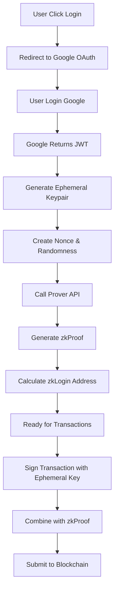

### zkLogin là gì?

**zkLogin** là một công nghệ blockchain tiên tiến của Sui Network cho phép người dùng:
- 🔑 Đăng nhập bằng OAuth providers (Google, Facebook, Apple, etc.)
- 🚫 **KHÔNG CẦN** quản lý private keys truyền thống
- 🔐 Vẫn đảm bảo tính bảo mật và privacy cao
- 🌐 Dễ dàng onboard người dùng mới vào blockchain

### Tại sao zkLogin quan trọng?

```
❌ Cách truyền thống:
User → Tạo wallet → Backup seed phrase → Quản lý private key → Sợ mất key

✅ Với zkLogin:
User → Đăng nhập Google → Sử dụng blockchain ngay → Không lo mất key
```

### Ưu điểm của zkLogin:

| Ưu Điểm           | Mô Tả                                          |
| ----------------- | ---------------------------------------------- |
| **User-Friendly** | Không cần hiểu về crypto để sử dụng            |
| **Security**      | Sử dụng zero-knowledge proofs                  |
| **Privacy**       | OAuth provider không biết giao dịch blockchain |
| **Convenience**   | Không cần backup seed phrases                  |
| **Adoption**      | Giảm barrier to entry cho người dùng mới       |

---

## 🧠 Lý Thuyết Cơ Bản

### 1. Zero-Knowledge Proofs (ZKPs)

ZKP cho phép chứng minh bạn biết một thông tin mà không cần tiết lộ thông tin đó.

```
Ví dụ: Chứng minh bạn trên 18 tuổi mà không cần nói chính xác tuổi
```

**Trong zkLogin:**
- Chứng minh bạn sở hữu JWT hợp lệ từ Google
- Không tiết lộ nội dung JWT cho blockchain
- Blockchain chỉ biết rằng bạn đã được Google xác thực

### 2. JWT (JSON Web Token)

JWT là token được OAuth provider (Google) tạo ra sau khi đăng nhập thành công.

**Cấu trúc JWT:**
```
Header.Payload.Signature
```

**Ví dụ Payload:**
```json
{
  "iss": "https://accounts.google.com",
  "sub": "123456789",
  "aud": "your-client-id.apps.googleusercontent.com",
  "exp": 1234567890,
  "iat": 1234567800,
  "nonce": "random-nonce-value"
}
```

### 3. Ephemeral Keypair

- **Tạm thời**: Chỉ tồn tại trong session hiện tại
- **Mục đích**: Ký giao dịch thay cho user
- **Bảo mật**: Kết hợp với zkProof để tạo signature hợp lệ

### 4. Các Thành Phần Quan Trọng

| Thành Phần            | Mô Tả                     | Lưu Trữ        |
| --------------------- | ------------------------- | -------------- |
| **JWT**               | Token từ OAuth provider   | localStorage   |
| **Ephemeral Keypair** | Cặp key tạm thời          | sessionStorage |
| **Randomness**        | Số ngẫu nhiên bảo mật     | sessionStorage |
| **Salt**              | Tạo địa chỉ duy nhất      | localStorage   |
| **Nonce**             | Chống replay attacks      | sessionStorage |
| **zkProof**           | Bằng chứng zero-knowledge | Memory         |

---

## 🔄 Luồng Hoạt Động

### Sơ Đồ Tổng Quan



### Chi Tiết Từng Bước

#### Bước 1: OAuth Login
```typescript
// 1.1. Tạo ephemeral keypair
const ephemeralKeyPair = Ed25519Keypair.generate();

// 1.2. Tạo randomness và nonce
const randomness = generateRandomness();
const nonce = generateNonce(ephemeralKeyPair.getPublicKey(), maxEpoch, randomness);

// 1.3. Redirect đến Google
const authUrl = `https://accounts.google.com/o/oauth2/v2/auth?${params}`;
window.location.replace(authUrl);
```

#### Bước 2: Nhận JWT và Setup zkLogin
```typescript
// 2.1. Nhận JWT từ URL hash
const urlParams = parseUrlHash();
const jwt = urlParams.id_token;

// 2.2. Tính zkLogin address
const zkLoginAddress = jwtToAddress(jwt, salt);

// 2.3. Gọi Prover API
const zkProof = await callProverAPI({
  jwt: jwt,
  extendedEphemeralPublicKey: extendedPublicKey,
  maxEpoch: maxEpoch,
  jwtRandomness: randomness,
  salt: salt,
  keyClaimName: "sub"
});
```

#### Bước 3: Thực Hiện Giao Dịch
```typescript
// 3.1. Tạo transaction
const txb = new Transaction();
const [coin] = txb.splitCoins(txb.gas, [MIST_PER_SUI]);
txb.transferObjects([coin], recipientAddress);

// 3.2. Ký với ephemeral key
const { bytes, signature: userSignature } = await txb.sign({
  client: suiClient,
  signer: ephemeralKeyPair
});

// 3.3. Tạo zkLogin signature
const zkLoginSignature = getZkLoginSignature({
  inputs: { ...zkProof, addressSeed },
  maxEpoch,
  userSignature
});

// 3.4. Submit transaction
const result = await suiClient.executeTransactionBlock({
  transactionBlock: bytes,
  signature: zkLoginSignature
});
```

---

## ⚙️ Setup Môi Trường

### 1. Yêu Cầu Hệ Thống

```bash
Node.js >= 18
npm hoặc pnpm
Git
Browser hỗ trợ modern JavaScript
```

### 2. Clone và Cài Đặt

```bash
# Clone repository
git clone <repository-url>
cd zklogin-react-example

# Cài đặt dependencies
pnpm install

# Copy environment file
cp env.example .env
```

### 3. Setup Google OAuth

#### 3.1. Tạo Google Cloud Project
1. Vào [Google Cloud Console](https://console.cloud.google.com/)
2. Tạo project mới hoặc chọn project có sẵn
3. Enable "Google+ API" trong Library

#### 3.2. Tạo OAuth Credentials
```
1. Vào "APIs & Services" → "Credentials"
2. Click "Create Credentials" → "OAuth 2.0 Client IDs"
3. Application type: "Web application"
4. Name: "zkLogin Demo"
5. Authorized redirect URIs: 
   - http://localhost:5173
   - https://yourdomain.com (nếu deploy)
6. Copy Client ID
```

#### 3.3. Cấu Hình Environment
```env
# .env file
VITE_GOOGLE_CLIENT_ID=1067056172111-abc123...apps.googleusercontent.com
VITE_REDIRECT_URI=http://localhost:5173
VITE_FULLNODE_URL=https://fullnode.devnet.sui.io
VITE_PROVER_URL=https://prover-dev.mystenlabs.com/v1
```

### 4. Chạy Development Server

```bash
pnpm dev
# Mở http://localhost:5173
```

---

## 🛠 Implement Từng Bước

### Bước 1: Setup Constants

```typescript
// Constants - Dễ dàng tùy chỉnh
const CLIENT_ID = import.meta.env.VITE_GOOGLE_CLIENT_ID;
const REDIRECT_URI = import.meta.env.VITE_REDIRECT_URI;
const FULLNODE_URL = import.meta.env.VITE_FULLNODE_URL;
const SUI_PROVER_DEV_ENDPOINT = import.meta.env.VITE_PROVER_URL;

// Transaction config
const TRANSFER_AMOUNT = 1n; // 1 SUI
const RECIPIENT_ADDRESS = "0xfa0f8542f256e669694624aa3ee7bfbde5af54641646a3a05924cf9e329a8a36";

// Storage keys
const STORAGE_KEYS = {
  EPHEMERAL_KEY_PAIR: "ephemeralKeyPair",
  RANDOMNESS: "randomness", 
  SALT: "zkloginSalt",
  NONCE: "zkloginNonce",
  JWT_TOKEN: "jwtString",
  ZK_ADDRESS: "zkLoginAddress",
} as const;
```

### Bước 2: Setup State Management

```typescript
function App() {
  // Authentication state
  const [jwtString, setJwtString] = useState("");
  const [decodedJwt, setDecodedJwt] = useState<JwtPayload>();
  
  // zkLogin state
  const [ephemeralKeyPair, setEphemeralKeyPair] = useState<Ed25519Keypair>();
  const [randomness, setRandomness] = useState("");
  const [salt, setSalt] = useState("");
  const [nonce, setNonce] = useState("");
  const [zkLoginUserAddress, setZkLoginUserAddress] = useState("");
  const [zkProof, setZkProof] = useState<any>();
  
  // UI state
  const [loading, setLoading] = useState(false);
  const [error, setError] = useState<string>();
  const [isZkLoginReady, setIsZkLoginReady] = useState(false);
  
  // Sui client
  const suiClient = new SuiClient({ url: FULLNODE_URL });
```

### Bước 3: Implement OAuth Login

```typescript
const handleLoginWithGoogle = async () => {
  setLoading(true);
  setError(undefined);

  try {
    // 1. Tạo ephemeral keypair
    const newEphemeralKeyPair = Ed25519Keypair.generate();
    sessionStorage.setItem(
      STORAGE_KEYS.EPHEMERAL_KEY_PAIR,
      newEphemeralKeyPair.getSecretKey()
    );
    setEphemeralKeyPair(newEphemeralKeyPair);

    // 2. Lấy epoch hiện tại
    const { epoch } = await suiClient.getLatestSuiSystemState();
    const maxEpoch = Number(epoch) + 2;

    // 3. Tạo randomness
    const newRandomness = generateRandomness();
    sessionStorage.setItem(STORAGE_KEYS.RANDOMNESS, newRandomness);
    setRandomness(newRandomness);

    // 4. Tạo hoặc lấy salt
    let currentSalt = salt;
    if (!currentSalt) {
      currentSalt = generateRandomness();
      localStorage.setItem(STORAGE_KEYS.SALT, currentSalt);
      setSalt(currentSalt);
    }

    // 5. Tạo nonce
    const newNonce = generateNonce(
      newEphemeralKeyPair.getPublicKey(),
      maxEpoch,
      newRandomness
    );
    sessionStorage.setItem(STORAGE_KEYS.NONCE, newNonce);
    setNonce(newNonce);

    // 6. Redirect đến Google OAuth
    const params = new URLSearchParams({
      client_id: CLIENT_ID,
      redirect_uri: REDIRECT_URI,
      response_type: "id_token",
      scope: "openid",
      nonce: newNonce,
    });

    window.location.replace(
      `https://accounts.google.com/o/oauth2/v2/auth?${params}`
    );
  } catch (e) {
    setError(`Login error: ${e instanceof Error ? e.message : String(e)}`);
    setLoading(false);
  }
};
```

### Bước 4: Setup zkLogin sau khi có JWT

```typescript
useEffect(() => {
  const setupZkLogin = async () => {
    // Kiểm tra tất cả dữ liệu cần thiết
    if (!jwtString || !decodedJwt || !ephemeralKeyPair || !randomness || !salt) {
      return;
    }

    setLoading(true);
    setError(undefined);

    try {
      // 1. Tính toán zkLogin address
      const address = jwtToAddress(jwtString, salt);
      setZkLoginUserAddress(address);
      localStorage.setItem(STORAGE_KEYS.ZK_ADDRESS, address);

      // 2. Lấy extended ephemeral public key
      const extPubKey = getExtendedEphemeralPublicKey(
        ephemeralKeyPair.getPublicKey()
      );
      setExtendedEphemeralPublicKey(extPubKey);

      // 3. Lấy epoch hiện tại
      const { epoch } = await suiClient.getLatestSuiSystemState();
      const maxEpoch = Number(epoch) + 2;

      // 4. Gọi Prover API để tạo zkProof
      const zkProofData = await callProverAPI({
        jwt: jwtString,
        extendedEphemeralPublicKey: extPubKey,
        maxEpoch,
        jwtRandomness: randomness,
        salt,
        keyClaimName: "sub",
      });
      
      setZkProof(zkProofData);
      setIsZkLoginReady(true);
    } catch (e) {
      setError(`zkLogin setup error: ${e instanceof Error ? e.message : String(e)}`);
    } finally {
      setLoading(false);
    }
  };

  setupZkLogin();
}, [jwtString, decodedJwt, ephemeralKeyPair, randomness, salt]);
```

### Bước 5: Implement Transaction Execution

```typescript
const handleExecuteTransaction = async () => {
  if (!zkProof || !decodedJwt || !ephemeralKeyPair || !zkLoginUserAddress) {
    setError("zkLogin not ready for transaction execution");
    return;
  }

  setIsExecutingTransaction(true);
  setError(undefined);

  try {
    // 1. Lấy epoch hiện tại
    const { epoch } = await suiClient.getLatestSuiSystemState();
    const maxEpoch = Number(epoch) + 2;

    // 2. Tạo transaction
    const txb = new Transaction();
    const [coin] = txb.splitCoins(txb.gas, [MIST_PER_SUI * TRANSFER_AMOUNT]);
    txb.transferObjects([coin], RECIPIENT_ADDRESS);
    txb.setSender(zkLoginUserAddress);

    // 3. Ký transaction với ephemeral key
    const { bytes, signature: userSignature } = await txb.sign({
      client: suiClient,
      signer: ephemeralKeyPair,
    });

    // 4. Tạo address seed
    if (!decodedJwt.sub || !decodedJwt.aud) {
      throw new Error("JWT missing required claims (sub or aud)");
    }

    const addressSeed = genAddressSeed(
      BigInt(salt),
      "sub",
      decodedJwt.sub,
      decodedJwt.aud as string
    ).toString();

    // 5. Tạo zkLogin signature
    const zkLoginSignature = getZkLoginSignature({
      inputs: { ...zkProof, addressSeed },
      maxEpoch,
      userSignature,
    });

    // 6. Submit transaction
    const executeRes = await suiClient.executeTransactionBlock({
      transactionBlock: bytes,
      signature: zkLoginSignature,
    });

    setExecuteDigest(executeRes.digest);
  } catch (e) {
    setError(`Transaction execution error: ${e instanceof Error ? e.message : String(e)}`);
  } finally {
    setIsExecutingTransaction(false);
  }
};
```

---

## 💻 Code Examples

### 1. Utility Functions

```typescript
// Parse URL hash parameters
const parseUrlHash = () => {
  try {
    const hash = window.location.hash.substring(1);
    const params = new URLSearchParams(hash);
    return Object.fromEntries(params.entries());
  } catch (e) {
    console.error("Error parsing URL hash:", e);
    return {};
  }
};

// Call Prover API
const callProverAPI = async (payload: any) => {
  const response = await fetch(SUI_PROVER_DEV_ENDPOINT, {
    method: "POST",
    headers: { "Content-Type": "application/json" },
    body: JSON.stringify(payload),
  });

  if (!response.ok) {
    throw new Error(`Prover API error: ${response.status} ${response.statusText}`);
  }

  return await response.json();
};
```

### 2. Storage Management

```typescript
// Khôi phục state từ storage
useEffect(() => {
  // JWT từ localStorage
  const storedJwt = localStorage.getItem(STORAGE_KEYS.JWT_TOKEN);
  if (storedJwt) {
    setJwtString(storedJwt);
    try {
      setDecodedJwt(jwtDecode(storedJwt));
    } catch {
      setError("Stored JWT is invalid");
    }
  }

  // Ephemeral keypair từ sessionStorage
  const storedKey = sessionStorage.getItem(STORAGE_KEYS.EPHEMERAL_KEY_PAIR);
  if (storedKey) {
    try {
      setEphemeralKeyPair(Ed25519Keypair.fromSecretKey(storedKey));
    } catch {
      sessionStorage.removeItem(STORAGE_KEYS.EPHEMERAL_KEY_PAIR);
    }
  }

  // Các giá trị khác...
  const storedRandomness = sessionStorage.getItem(STORAGE_KEYS.RANDOMNESS);
  if (storedRandomness) setRandomness(storedRandomness);

  const storedSalt = localStorage.getItem(STORAGE_KEYS.SALT);
  if (storedSalt) setSalt(storedSalt);
}, []);
```

### 3. Reset/Logout Function

```typescript
const handleReset = () => {
  try {
    // Xóa session storage
    sessionStorage.removeItem(STORAGE_KEYS.EPHEMERAL_KEY_PAIR);
    sessionStorage.removeItem(STORAGE_KEYS.RANDOMNESS);
    sessionStorage.removeItem(STORAGE_KEYS.NONCE);

    // Xóa local storage
    localStorage.removeItem(STORAGE_KEYS.JWT_TOKEN);
    localStorage.removeItem(STORAGE_KEYS.ZK_ADDRESS);

    // Reset state
    setEphemeralKeyPair(undefined);
    setRandomness("");
    setNonce("");
    setJwtString("");
    setDecodedJwt(undefined);
    setZkLoginUserAddress("");
    setZkProof(undefined);
    setError(undefined);
    setLoading(false);
    setIsZkLoginReady(false);
  } catch (e) {
    setError(`Reset error: ${e instanceof Error ? e.message : String(e)}`);
  }
};
```

---

## ✅ Best Practices

### 1. Security Best Practices

```typescript
// ✅ DO: Validate JWT before using
try {
  const decoded = jwtDecode(jwtString);
  if (!decoded.sub || !decoded.aud) {
    throw new Error("Invalid JWT claims");
  }
  setDecodedJwt(decoded);
} catch (e) {
  setError("Invalid JWT token");
  return;
}

// ✅ DO: Check expiration
if (decoded.exp && Date.now() / 1000 > decoded.exp) {
  setError("JWT token expired");
  return;
}

// ❌ DON'T: Store sensitive data in localStorage
// localStorage.setItem("privateKey", key); // NEVER DO THIS

// ✅ DO: Use sessionStorage for ephemeral data
sessionStorage.setItem(STORAGE_KEYS.EPHEMERAL_KEY_PAIR, keyPair.getSecretKey());
```

### 2. Error Handling

```typescript
// ✅ DO: Comprehensive error handling
const handleError = (error: unknown, context: string) => {
  const message = error instanceof Error ? error.message : String(error);
  console.error(`${context}:`, error);
  setError(`${context}: ${message}`);
};

try {
  await riskyOperation();
} catch (e) {
  handleError(e, "Transaction execution failed");
}
```

### 3. State Management

```typescript
// ✅ DO: Use proper TypeScript types
interface ZkLoginState {
  jwtString: string;
  decodedJwt?: JwtPayload;
  ephemeralKeyPair?: Ed25519Keypair;
  randomness: string;
  salt: string;
  nonce: string;
  zkLoginUserAddress: string;
  zkProof?: any;
  isReady: boolean;
}

// ✅ DO: Validate state before operations
const validateZkLoginState = (): boolean => {
  return !!(
    jwtString &&
    decodedJwt &&
    ephemeralKeyPair &&
    randomness &&
    salt &&
    zkProof
  );
};
```

### 4. Performance Optimization

```typescript
// ✅ DO: Memoize expensive calculations
const zkLoginAddress = useMemo(() => {
  if (!jwtString || !salt) return "";
  return jwtToAddress(jwtString, salt);
}, [jwtString, salt]);

// ✅ DO: Debounce API calls
const debouncedProverCall = useCallback(
  debounce(async (payload) => {
    return await callProverAPI(payload);
  }, 1000),
  []
);
```

---

## 🚨 Troubleshooting

### Lỗi Thường Gặp

#### 1. "Invalid JWT token"
```typescript
// Nguyên nhân:
- JWT bị hỏng hoặc không đúng format
- JWT đã hết hạn
- Nonce không khớp

// Giải pháp:
- Kiểm tra JWT format
- Verify JWT trên jwt.io
- Đăng nhập lại để lấy JWT mới
```

#### 2. "Network Error" khi gọi Prover API
```typescript
// Nguyên nhân:
- Prover API server quá tải
- Network connectivity issues
- CORS issues

// Giải pháp:
const callProverAPIWithRetry = async (payload: any, retries = 3) => {
  for (let i = 0; i < retries; i++) {
    try {
      return await callProverAPI(payload);
    } catch (e) {
      if (i === retries - 1) throw e;
      await new Promise(resolve => setTimeout(resolve, 1000 * (i + 1)));
    }
  }
};
```

#### 3. "Transaction execution failed"
```typescript
// Nguyên nhân:
- Không đủ gas fee
- Địa chỉ recipient không hợp lệ
- zkProof không đúng
- Epoch đã expired

// Giải pháp:
// Check balance trước khi giao dịch
const checkBalance = async (address: string) => {
  const balance = await suiClient.getBalance({ owner: address });
  const balanceInSui = Number(balance.totalBalance) / 1_000_000_000;
  
  if (balanceInSui < TRANSFER_AMOUNT) {
    throw new Error(`Insufficient balance. Need ${TRANSFER_AMOUNT} SUI, have ${balanceInSui} SUI`);
  }
};
```

#### 4. "Google OAuth redirect error"
```typescript
// Nguyên nhân:
- Redirect URI không khớp với Google Console setup
- Client ID không đúng
- Domain không được authorize

// Giải pháp:
// Kiểm tra Google Console settings
const validateOAuthConfig = () => {
  if (!CLIENT_ID || CLIENT_ID === "your-google-client-id") {
    throw new Error("Please configure VITE_GOOGLE_CLIENT_ID in .env");
  }
  
  if (!REDIRECT_URI.startsWith("http")) {
    throw new Error("REDIRECT_URI must be a valid URL");
  }
};
```

### Debug Tools

#### 1. Console Logging
```typescript
// Enable debug mode
const DEBUG = import.meta.env.DEV;

const debugLog = (message: string, data?: any) => {
  if (DEBUG) {
    console.log(`[zkLogin Debug] ${message}`, data);
  }
};

// Usage
debugLog("JWT received", { jwt: jwtString, decoded: decodedJwt });
debugLog("zkProof generated", zkProof);
```

#### 2. State Inspector
```typescript
// Custom hook for debugging state
const useZkLoginDebug = () => {
  const state = {
    jwtString,
    decodedJwt,
    ephemeralKeyPair: ephemeralKeyPair?.getPublicKey().toBase64(),
    randomness,
    salt,
    nonce,
    zkLoginUserAddress,
    zkProof,
    isReady: isZkLoginReady,
  };
  
  useEffect(() => {
    if (DEBUG) {
      console.table(state);
    }
  }, [state]);
  
  return state;
};
```

---

## 🚀 Advanced Topics

### 1. Custom OAuth Providers

```typescript
// Thêm support cho Facebook
const handleLoginWithFacebook = async () => {
  const params = new URLSearchParams({
    client_id: FACEBOOK_CLIENT_ID,
    redirect_uri: REDIRECT_URI,
    response_type: "id_token",
    scope: "openid",
    nonce: nonce,
  });

  window.location.replace(
    `https://www.facebook.com/v18.0/dialog/oauth?${params}`
  );
};

// Generic OAuth handler
const handleOAuthLogin = async (provider: 'google' | 'facebook' | 'apple') => {
  const configs = {
    google: {
      authUrl: "https://accounts.google.com/o/oauth2/v2/auth",
      clientId: GOOGLE_CLIENT_ID,
    },
    facebook: {
      authUrl: "https://www.facebook.com/v18.0/dialog/oauth", 
      clientId: FACEBOOK_CLIENT_ID,
    },
    // ... other providers
  };
  
  const config = configs[provider];
  // Implementation...
};
```

### 2. Multi-Signature Transactions

```typescript
// Tạo transaction cần nhiều chữ ký
const createMultiSigTransaction = async () => {
  const txb = new Transaction();
  
  // Thêm nhiều operations
  const [coin1] = txb.splitCoins(txb.gas, [MIST_PER_SUI]);
  const [coin2] = txb.splitCoins(txb.gas, [MIST_PER_SUI * 2n]);
  
  txb.transferObjects([coin1], RECIPIENT_1);
  txb.transferObjects([coin2], RECIPIENT_2);
  
  return txb;
};
```

### 3. Session Management

```typescript
// Custom session manager
class ZkLoginSession {
  private static instance: ZkLoginSession;
  private sessionData: Map<string, any> = new Map();
  
  static getInstance(): ZkLoginSession {
    if (!ZkLoginSession.instance) {
      ZkLoginSession.instance = new ZkLoginSession();
    }
    return ZkLoginSession.instance;
  }
  
  set(key: string, value: any, persistent = false): void {
    this.sessionData.set(key, value);
    
    const storage = persistent ? localStorage : sessionStorage;
    storage.setItem(key, JSON.stringify(value));
  }
  
  get(key: string): any {
    if (this.sessionData.has(key)) {
      return this.sessionData.get(key);
    }
    
    // Try sessionStorage first, then localStorage
    let stored = sessionStorage.getItem(key) || localStorage.getItem(key);
    if (stored) {
      try {
        const parsed = JSON.parse(stored);
        this.sessionData.set(key, parsed);
        return parsed;
      } catch (e) {
        console.warn(`Failed to parse stored value for key: ${key}`);
      }
    }
    
    return null;
  }
  
  clear(): void {
    this.sessionData.clear();
    sessionStorage.clear();
    // Only clear zkLogin related items from localStorage
    Object.values(STORAGE_KEYS).forEach(key => {
      localStorage.removeItem(key);
    });
  }
}

// Usage
const session = ZkLoginSession.getInstance();
session.set(STORAGE_KEYS.JWT_TOKEN, jwtString, true); // persistent
session.set(STORAGE_KEYS.EPHEMERAL_KEY_PAIR, keypair.getSecretKey()); // session only
```

### 4. Transaction Batching

```typescript
// Batch multiple transactions
const executeBatchTransactions = async (transactions: Transaction[]) => {
  const results = [];
  
  for (const txb of transactions) {
    try {
      txb.setSender(zkLoginUserAddress);
      
      const { bytes, signature: userSignature } = await txb.sign({
        client: suiClient,
        signer: ephemeralKeyPair,
      });
      
      const zkLoginSignature = getZkLoginSignature({
        inputs: { ...zkProof, addressSeed },
        maxEpoch,
        userSignature,
      });
      
      const result = await suiClient.executeTransactionBlock({
        transactionBlock: bytes,
        signature: zkLoginSignature,
      });
      
      results.push(result);
    } catch (e) {
      console.error("Transaction failed:", e);
      results.push({ error: e });
    }
  }
  
  return results;
};
```

### 5. Gas Optimization

```typescript
// Estimate gas before transaction
const estimateGas = async (txb: Transaction) => {
  try {
    const dryRun = await suiClient.dryRunTransactionBlock({
      transactionBlock: await txb.build({ client: suiClient }),
    });
    
    return {
      gasUsed: dryRun.effects.gasUsed,
      success: dryRun.effects.status.status === 'success',
      error: dryRun.effects.status.error,
    };
  } catch (e) {
    console.error("Gas estimation failed:", e);
    return null;
  }
};

// Optimize gas usage
const optimizeTransaction = async (txb: Transaction) => {
  // Set reasonable gas budget
  txb.setGasBudget(10_000_000); // 0.01 SUI
  
  // Use gas coin efficiently
  const gasEstimate = await estimateGas(txb);
  if (gasEstimate && gasEstimate.gasUsed) {
    // Add 20% buffer
    const optimalGas = Math.ceil(gasEstimate.gasUsed.computationCost * 1.2);
    txb.setGasBudget(optimalGas);
  }
  
  return txb;
};
```

---

## 📝 Kết Luận

### Những gì bạn đã học được:

1. **Lý thuyết zkLogin**: Hiểu cách zero-knowledge proofs hoạt động với OAuth
2. **Implementation**: Triển khai hoàn chỉnh zkLogin trong React
3. **Best Practices**: Các thực hành tốt về security và performance
4. **Troubleshooting**: Cách debug và xử lý lỗi
5. **Advanced Topics**: Các chủ đề nâng cao cho production

### Next Steps:

- 🔄 **Practice**: Thử implement các tính năng mới
- 🌐 **Deploy**: Deploy lên production với proper security
- 📚 **Learn More**: Tìm hiểu sâu hơn về Sui ecosystem
- 🤝 **Contribute**: Đóng góp cho Sui community

### Resources:

- [Sui zkLogin Docs](https://docs.sui.io/concepts/cryptography/zklogin)
- [Sui TypeScript SDK](https://sdk.mystenlabs.com/typescript)
- [Google OAuth 2.0 Guide](https://developers.google.com/identity/protocols/oauth2)

---

**Happy Coding! 🎉**

> **Lưu ý**: Tài liệu này dành cho mục đích học tập. Khi deploy production, hãy đảm bảo security và compliance với các quy định về privacy.